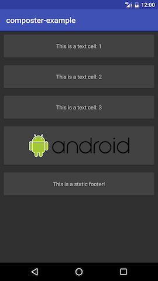

# Composter
[](https://jitpack.io/#robotoworks/composter)

Composter is a RecyclerView data binding framework that favors composition over inheritance.


## Features
*   Makes handling multiple view types easy and flexible.
*   Adds missing static header and footer support to the RecyclerView
*   Plugs into any data set you like! It can be a list, a cursor, your RealmObject result list, etc. Just implement the provided `RecyclerDataset` interface and set it on the adapter. A base class for a list is provided for convenience, but if you don't like inheritance you can roll your own!


## Usage
Create your view holders as usual:

```java
public class StringItemViewHolder extends ViewHolder {
    private TextView textView;

    public StringItemViewHolder(View itemView) {
        super(itemView);
        textView = (TextView) itemView.findViewById(R.id.text)
    }

    public void setText(String text) {
        textView.setText(text);
    }
}

public class ImageItemViewHolder extends InjectableViewHolder {

    private ImageView imageView;

    public ImageItemViewHolder(View itemView) {
        super(itemView);
        imageView = (ImageView) itemView.findViewById(R.id.image);
    }

    public void setImageUrl(String url) {

        Picasso.with(itemView.getContext()).load(url).into(imageView);
    }
}
```
Create a binder registrar and view holder factories for your view types... :

```java
public class ExampleBinderRegistrar implements BinderRegistrar {

    ...

    @Override
    public void registerViewHolderFactories(ViewHolderRegistry viewHolderRegistry) {
        viewHolderRegistry.registerViewHolderFactory(ViewType.STRING_LIST_ITEM.ordinal(), new ViewHolderFactory() {
            @Override
            public RecyclerView.ViewHolder createViewHolder(ViewGroup parent) {
                return createStringViewHolder(parent);
            }
        });

        viewHolderRegistry.registerViewHolderFactory(ViewType.IMAGE_LIST_ITEM.ordinal(), new ViewHolderFactory() {
            @Override
            public RecyclerView.ViewHolder createViewHolder(ViewGroup parent) {
                return createImageViewHolder(parent);
            }
        });

        viewHolderRegistry.registerViewHolderFactory(ViewType.FOOTER_TEXT.ordinal(), new ViewHolderFactory() {
            @Override
            public RecyclerView.ViewHolder createViewHolder(ViewGroup parent) {
                return createStringViewHolder(parent);
            }
        });
    }

    @NonNull
    private RecyclerView.ViewHolder createImageViewHolder(ViewGroup parent) {
        final View view = LayoutInflater.from(parent.getContext()).inflate(R.layout.list_item_image, parent, false);
        ImageItemViewHolder viewHolder = new ImageItemViewHolder(view);
        return viewHolder;
    }

    @NonNull
    private RecyclerView.ViewHolder createStringViewHolder(ViewGroup parent) {
        final View view = LayoutInflater.from(parent.getContext()).inflate(R.layout.list_item_string, parent, false);
        StringItemViewHolder viewHolder = new StringItemViewHolder(view);
        return viewHolder;
    }
}
```

... and binders that bind the data to your item view holders as well as any static headers or footers (headers and footers appear in the list in the order they were added):

```java
public class ExampleBinderRegistrar implements BinderRegistrar {

    @Override
    public void registerBinders(BinderRegistry binderRegistry) {

        binderRegistry.registerItemBinder(ViewType.IMAGE_LIST_ITEM.ordinal(), new ItemBinder<ImageListItem, ImageItemViewHolder>() {
            @Override
            public void bindItem(ImageListItem imageListItem, ImageItemViewHolder viewHolder) {
                viewHolder.setImageUrl(imageListItem.getImageUrl());
            }
        });

        binderRegistry.registerItemBinder(ViewType.STRING_LIST_ITEM.ordinal(), new ItemBinder<StringListItem, StringItemViewHolder>() {
            @Override
            public void bindItem(StringListItem item, StringItemViewHolder viewHolder) {
                viewHolder.setText(item.getText());
            }
        });

        binderRegistry.registerFooterBinder(ViewType.FOOTER_TEXT.ordinal(), new StaticBinder<StringItemViewHolder>() {
            @Override
            public void bind(StringItemViewHolder viewHolder) {
                viewHolder.setText("This is a static footer!");
            }
        });
    }

    ...
}
```

Now to bring it all together:

```java
// This is going to be our example data source
ArrayList<ListItem> listItems = new ArrayList<>();
listItems.add(new StringListItem("This is a text cell: 1"));
listItems.add(new StringListItem("This is a text cell: 2"));
listItems.add(new StringListItem("This is a text cell: 3"));
listItems.add(new ImageListItem("http://www.camsam.com/wp-content/uploads/2015/04/Android_Logo_2014.svg_.png"));
RecyclerDataSet<ListItem> dataSource = new ListRecyclerDataSet<ListItem>(listItems) {
          @Override
          public int getItemViewType(int position) {

              return getItem(position).getViewType();
          }
      };


recyclerView.setLayoutManager(new LinearLayoutManager(this));
adapter = new RecyclerViewAdapter<>(new BinderManager(), new ExampleBinderRegistrar());
recyclerView.setAdapter(adapter);
adapter.setSource(dataSource);

// We're still responsible for fine-grained control
adapter.notifyDataSetChanged();
```

The end result is this:



## Including this library
```
repositories {
    maven { url 'https://jitpack.io' }
}

dependencies {  
    compile 'com.github.robotoworks:composter:1.1'
}
```

## Licence

```
Copyright 2017 Ian Warwick, Mikolaj Leszczynski

Licensed under the Apache License, Version 2.0 (the "License");
you may not use this file except in compliance with the License.
You may obtain a copy of the License at

   http://www.apache.org/licenses/LICENSE-2.0

Unless required by applicable law or agreed to in writing, software
distributed under the License is distributed on an "AS IS" BASIS,
WITHOUT WARRANTIES OR CONDITIONS OF ANY KIND, either express or implied.
See the License for the specific language governing permissions and
limitations under the License.
```
